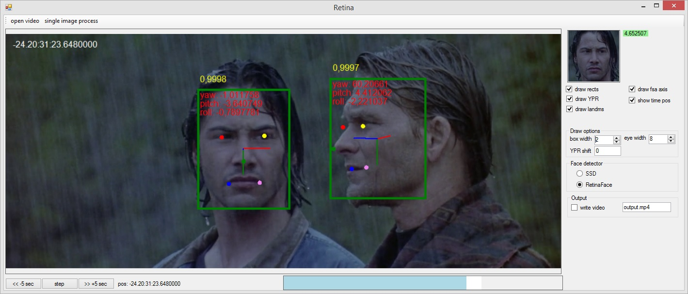
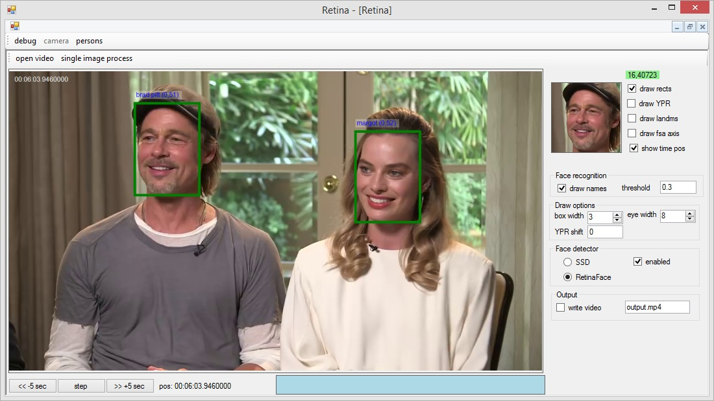
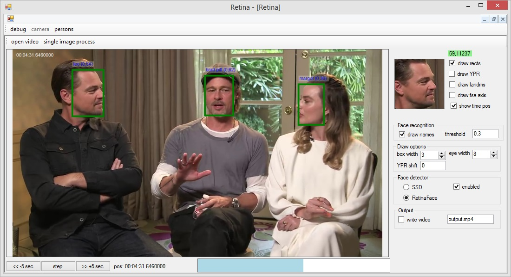
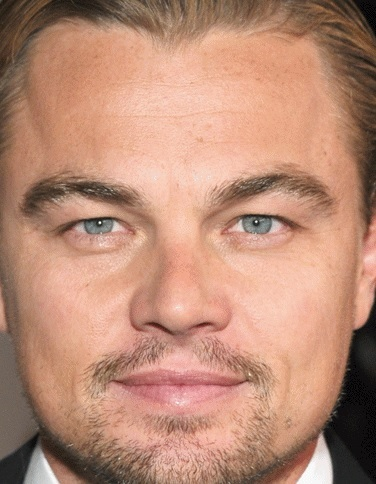
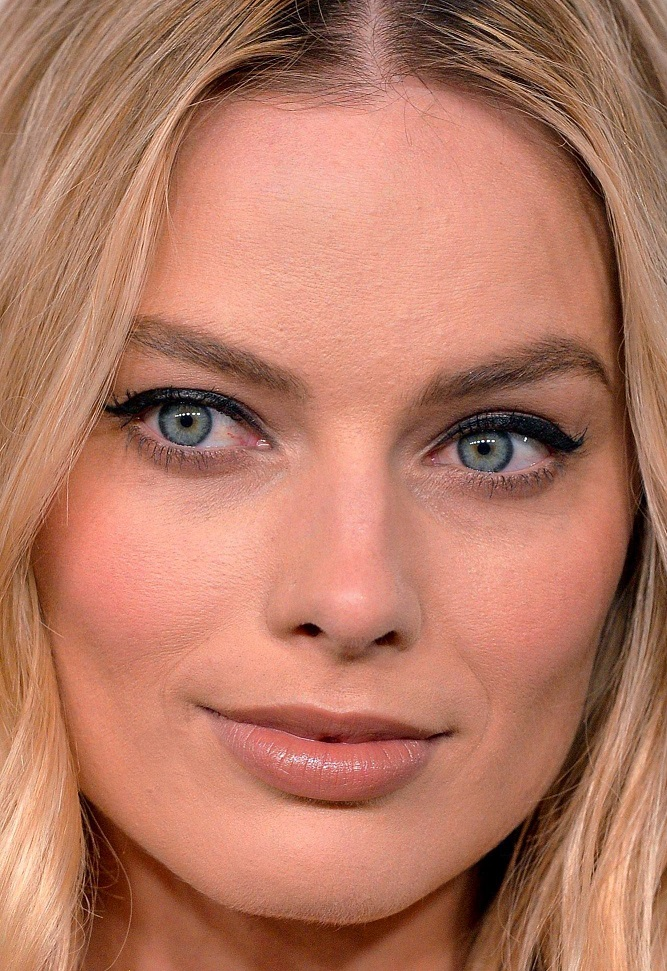

# Retina
Face detection debug tool

**Project status: WIP**

# Face detection (axes, 5-point landmark)

# Face recognition

**Reference images:**

 |  | 

# Nets:
* RetinaFace (https://github.com/biubug6/Pytorch_Retinaface)
* FSA.Net and SSD300 (https://github.com/omasaht/headpose-fsanet-pytorch)
* FaceNet (https://github.com/Dhairya10/facenet-openvino)
